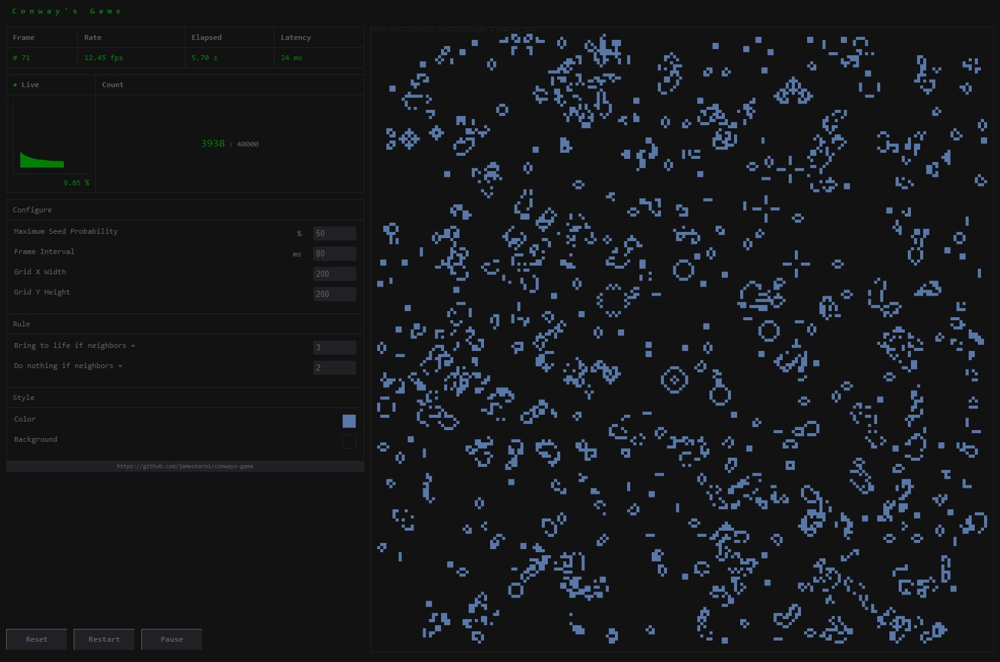

# Conways Game
Conway's cellular automation game of life. Try out different configurations and
appreciate beautiful mathematics.

## Highlights
- Real time metrics
  - Population
  - Live graph
  - Frame rate
  - Elapsed time
  - Latency
- Configurable settings
  - Grid size up to 200 x 200
  - Seed probability
  - Frame interval
  - Game rules
  - Colors

## Screen Shot
  

## Set runtime variables
    HOST=your-server-host
    PORT=your-server-port
